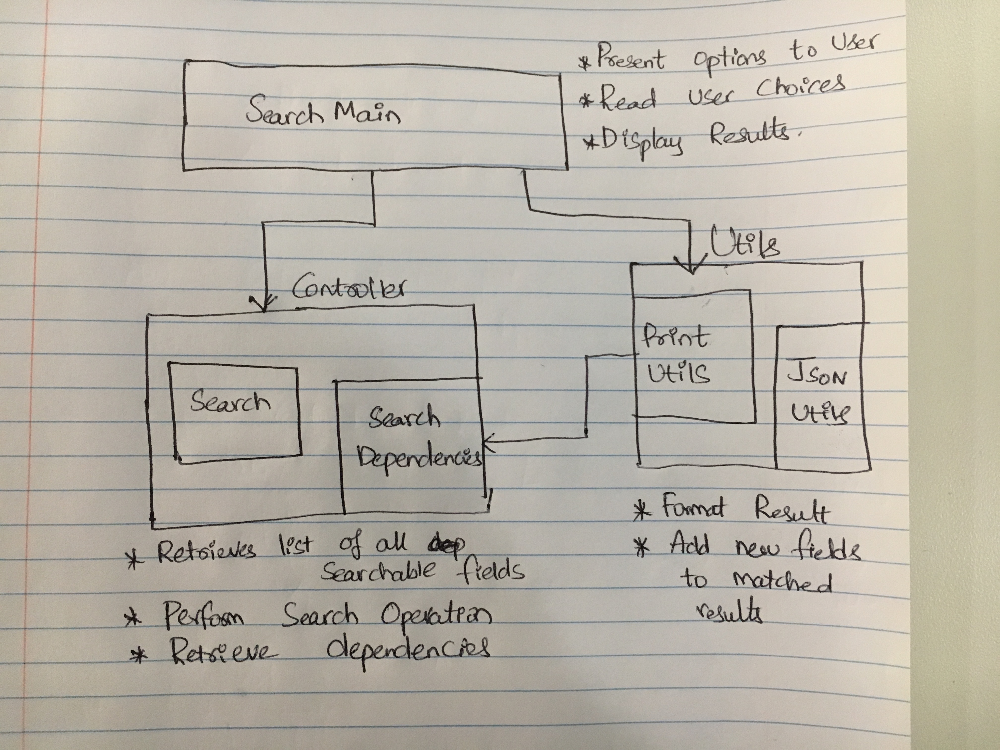

# json-search
Command line application to search from given json data and return matched results

## Build status
Build status of continus integration on travis: https://travis-ci.org/Vempalli/json-search

## Prerequisites
To run the tool we need the following

* gradle
* Java 8

## Building the project
* clone the project `git clone https://github.com/Vempalli/json-search.git`
* `cd json-search`
* `./gradlew build`

## Tests
From json-search folder execute command `./gradlew test`

## Running the project
From json-search folder execute command `./gradlew run --console=plain -q`

## Technical Details

### Features Available
* Client can select `users`, `organizations` or `tickets` as search category and we will display list of fields available on
these categories to search from
* User can pick a field from any of above categories and provide a value that is looking to search. The project looks for
exact match and also partial match on the selected field
* Matched search results are returned along with following related information
    * On User Search include organization name and all the tickets submitted by matched user
    * On Ticket Search include organization name and submitter name, assignee name for the matched ticket
* Search is case sensitive

### Assumptions
* The fields are same for each object of specific category. Ex: All user objects have same fields, all ticket objects 
have same fields
* The id for each object type is unique. Meaning they don't overlap across organizations and are scoped
* While retrieving related information, I only retrieved for user and ticket search. For organization we could have retrieved
all users in org and all tickets created in the org, but I did not get chance to implement this

### Design Decisions
In order to design a robust solution, Apart from accuracy, I have considered efficiency, memory utilization and 
ease of maintenance as key factors. Few design choices I had to make are:

* **JSON Processing Library choice** I had to make a choice on which JSON processing library to use. The 2 choices that I debated 
are between javaee's json-p and Google's Gson. Both of these support stream processing. While json-p is native from javaee 
and works using pull model it is relatively new and not much of formatting options exist for this. So I've decided 
to use Gson as it is mature enough and there is lot of help online if I run into any issues

* **Stream Processing Vs Object Model** The two choices I had to decide for reading the JSON is Object model and Stream
model. In object model, JSON structures are represented as a Java class. We will have a POJO class which represents any
JSON object of specific type and we build this object during processing. Note that we are actually building an object
and holding it in memory while we are parsing it. This looks okay for small JSON objects but for complex object structure
the class will be maintenance nightmare.
The other choice is a Streaming model, where we will read the JSON one event after the other. We will have iterator to the
JSON which helps to process this. At any point we are only holding the piece of json object that is currently being processed
in the memory (but not the whole object as in object model). This takes away dependency from memory but we will need to
handle some exception logic in case of streaming exceptions.
I used streaming model for this project

* **Caching** Currently the application only performs search operation. So everything is read intensive and there is always
scope to speed up search by introducing caching layer. I used Guava's cache which is easy to integrate. I have only cached
list of fields that are present in each json object type. I could have applied the same logic to store dependency information
between different objects or actual search results for that matter using guava but I am constrained by time on submitting this project.

#### Process Flow
The below diagram is just a flow/block diagram explaining all the different components involved

1. SearchMain is the entry point where user is presented menu and reads the user choices
2. Present the user with the list of available fields to search from selected category. These fields are cached and gets
refreshed every 10 minutes
3. Once the user selects the field and enters search term, invoke the Search class's search functionality which uses
JsonUtils to read the JSON data in streaming fashion
4. If a match is found collect the matched items in a list as there can be one or more matches
5. For every matched result, retrieve the related items and append the related item to matched result. The definition of
related item is explained in Features Available section
6. Finally pretty print the result and display matched results and related information to user

#### Future enhancements
* Currently the application is built considering single user use. We can support multiple requests by implementing 
multi threading or build a restful web application where threading model will be maintained by web server
* We can modify the system to read the streaming data from url rather than a file. This should just be a minimal change
* As pointed in Caching section, we can implement caching in other search operations

## Credits
https://github.com/google/guava/wiki/CachesExplained
https://github.com/javaee/jsonp